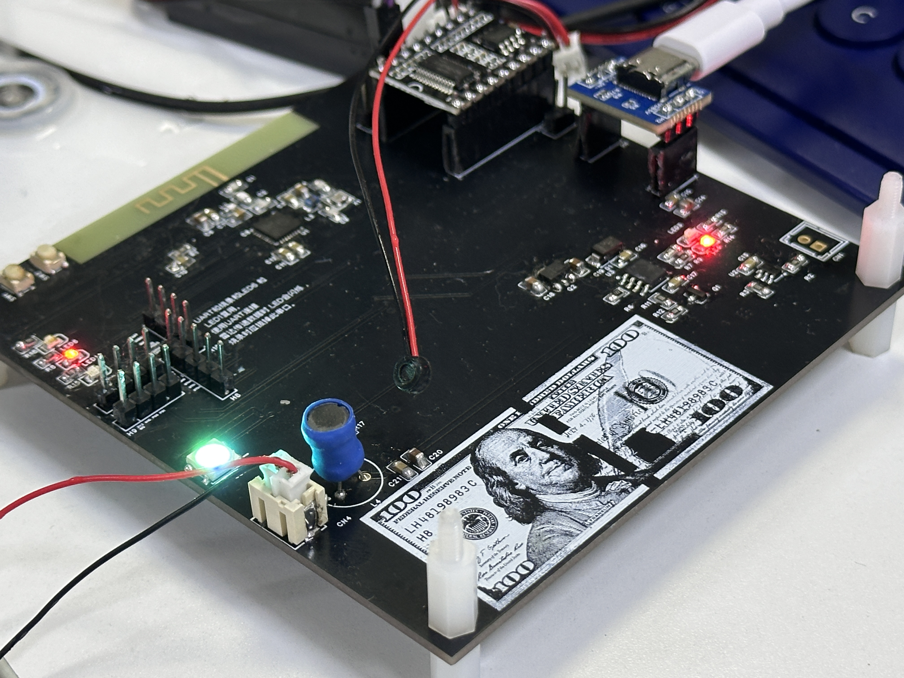
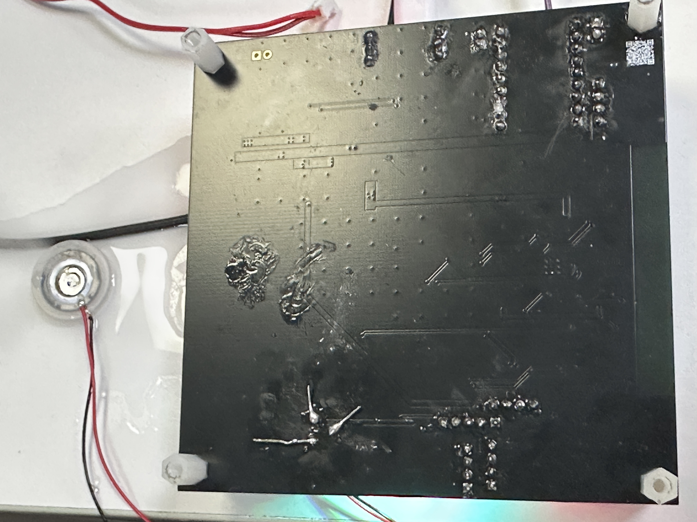
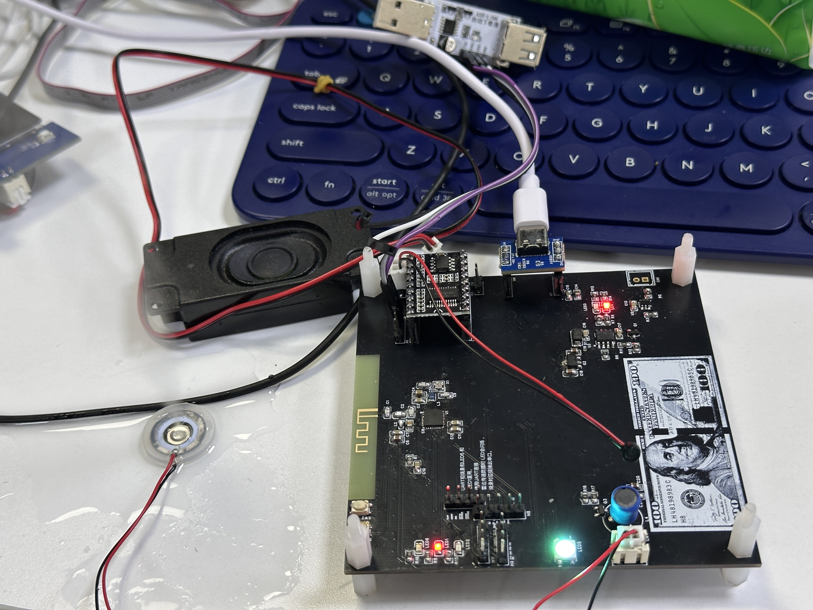

1. # 💧 智能物联网加湿器 V10 (全栈自研版)

   
   
   
   

   本项目是一个经历了从 V3 到 V10 深度迭代的全栈物联网设备。项目涵盖了从底层嘉立创 EDA 硬件画板、PCB 焊接调试，到顶层 FreeRTOS 软件架构设计的完整闭环。同时，本项目深度探索了 **AI 工具 (Cursor/Claude) 在嵌入式防御性编程与架构重构中的协同价值**。

   👉 **[点击查看：项目实机演示与技术复盘主页 (Apple 拟物风)](#)** *(网页端即将上线)*

   ---

   ## 📺 实机运行与系统全貌 (Showcase)

   

     <video src="images/实物全功能演示视频.mp4" width="100%" controls poster="images/实机演示_幻彩灯与雾化联动.jpg">
       您的浏览器不支持播放该视频，请在仓库中直接下载查看。
     </video>
     
<i>▶️ V10 最终交付版：完整演示按键切换、语音唤醒、多模态雾化与马卡龙灯效联动</i>

   

   |                  硬件正面静态 (高度集成)                  |                硬件背面细节 (电池保护与焊接)                 |
   | :-------------------------------------------------------: | :----------------------------------------------------------: |
   |  |  |
   |     |    |

   > 📎 **[核心开源资料：点击查看完整自研电路原理图 PDF (V10 版本)](Hardware/电路原理图_智能加湿器V10.pdf)**

   ---

   ## ⚔️ 核心技术攻坚与解决方案 (Technical Challenges)

   在开发过程中，为实现系统的工业级稳定性，重点攻克了以下四大技术难点：

   ### 1. 高频功率安全与 MOS 管过热保护 (硬件+软件双重防御)
   - **痛点**：微孔雾化片依赖 108kHz 的超声波谐振驱动，初期测试时长时间高功率输出极易烧毁 MOS 管和功率电感。
   - **攻坚**：采用 ESP32-C3 的 LEDC 外设生成精准 108kHz 硬件 PWM。在 AI 辅助下引入**“软件硬限位”防御性编程**，在 `bsp_atomizer.c` 底层中，无论业务逻辑传入多大数值，PWM 占空比被绝对削峰并锁定在 135 (45%) 以下，并加入了零电平安全启动机制，彻底根除烧毁隐患。

   ### 2. 第三方语音模块的硬件走线死区 (UART 矩阵路由)
   
   - **痛点**：对接“天问 51 (ASRPRO)”时，编辑器强制其发送端(TX)为 PA2，接收端(RX)为 PA3，但这与我们自研 PCB 的物理走线产生了交叉冲突。
   - **攻坚**：放弃飞线妥协。深入研究 ESP32-C3 的 GPIO 矩阵映射原理，在 `bsp_voice.c` 中使用 `uart_set_pin(UART_NUM_1, 20, 21...)` 实现了 **TX/RX 物理引脚职责的软件层动态翻转**，兵不血刃地完成了协议适配。

   ### 3. 幻彩灯光时序苛刻导致系统卡顿 (RMT 纳秒级驱动)
   - **痛点**：WS2812B 对时序要求达到纳秒级，传统 GPIO 翻转会受 FreeRTOS 任务调度打断，导致灯珠闪烁、主循环卡顿。
   - **攻坚**：舍弃常规写法，引入 ESP-IDF 官方推荐的 **RMT (Remote Control) 外设硬件接口**。像“录音机”一样将色彩数组一次性写入 RMT 硬件缓存，由硬件独立发送 10MHz 时序波形，实现 0 CPU 占用的全彩平滑过渡。

   ### 4. 复杂业务逻辑的多并发冲突 (FreeRTOS 事件驱动总线)
   - **痛点**：按键轮询、语音中断、定时器与雾化器状态机容易产生竞态条件。
   - **攻坚**：设计 `task_main_controller` 核心指挥官任务。构建 100ms 心跳节拍器，所有外设输入（长短按、UART 指令）统统打包为 Event ID 丢入 `g_evt_queue` 消息队列。彻底实现**“采集与执行解耦”**，确保了 3秒喷/3秒停（间歇模式）节拍的绝对精准。

   ---

   ## ⚙️ 系统元器件与架构矩阵

   | 模块分类     | 核心选型 / 技术方案    | 作用说明                                      |
   | :----------- | :--------------------- | :-------------------------------------------- |
   | **主控大脑** | ESP32-C3FN4            | RISC-V 核心，自带 4MB Flash，负责多任务调度   |
   | **电源系统** | TC4056A + XB5306A      | 线性充电管理与锂电池一体化双重保护电路        |
   | **交互输入** | 物理按键 + 天问 ASRPRO | 支持 GPIO 中断级长/短按，支持离线绝对语音指令 |
   | **视觉反馈** | WS2812B + 3路状态 LED  | 马卡龙色调动态反馈 + 灌电流模式单色指示       |
   | **动力输出** | AO3400 + XR8*10-300K   | MOSFET 驱动功率电感，108kHz 高频超声波谐振    |

   ---

   ## 🚀 后续演进计划 (Future Roadmap)

   - [ ] **并联扩展协同**：V10 版 PCB 背面已预留了 **4 组并联排母接口**，计划在 V11 引入多板级联协议，支持温湿度传感器阵列的分布式接入。
   - [ ] **原生蓝牙 App 联控**：代码底层已预留 BLE 蓝牙广播接口，计划开发配套的微信小程序，实现手机端动态调节雾量曲线。
   - [ ] **OTA 远程升级**：利用 ESP32-C3 的原生特性，加入通过 Wi-Fi 下发固件的热更新功能。

   ---

   ## ⚠️ 授权与防伪声明 (License)
   1. 本项目所有源码（含深度的中文架构注释）、硬件电路图、演示视频均为作者原创。
   2. 严禁任何形式的“简历造假 (Resume Fraud)”或未经授权的商业挪用。
   3. 拥抱开源，学习交流引用本项目思路或代码时，请务必在显著位置保留原作者署名。