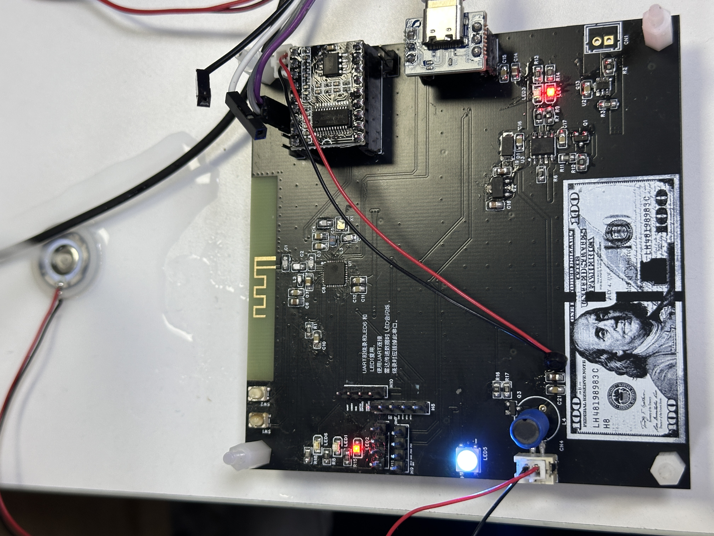

# 💧 智能物联网加湿器 V10 (全栈自研版)

本项目是一个经历了从 V3 到 V10 深度迭代的全栈嵌入式设备。不仅包含了从嘉立创 EDA 画板到实物焊接的完整硬件闭环，更展示了在现代开发流中，**如何深度利用 AI 工具进行系统架构重构与底层硬件攻坚**。

👉 **[点击查看：项目实机演示与技术复盘主页 (即将上线)](#)**

---

## 📸 硬件实机与架构展示

|                  实机运行 (幻彩与雾化联动)                   |                 正面整体架构 (3D 渲染)                 |
| :----------------------------------------------------------: | :----------------------------------------------------: |
|  |  |
|   *108kHz 驱动下稳定出雾，WS2812B 提供马卡龙色系状态反馈*    |    *高度集成的双层 PCB 设计，合理的元器件热力分布*     |

> 📎 **[点击此处查看：完整自研电路原理图 PDF (V10 版本)](Hardware/电路原理图_智能加湿器V10.pdf)**

---

## 🚀 核心架构与技术亮点 (Highlights)

本项目的代码摒弃了传统的“前后台大循环”裸机写法，在 AI 的辅助规划下，全面重构为**基于 FreeRTOS 的事件驱动型架构**，显著提升了系统的实时性与稳定性。

### 1. 🤖 AI 赋能的防御性编程 (Safety First)
微孔雾化片需要 108kHz 的超声波谐振驱动。为防止 MOS 管过热烧毁，结合 AI 对硬件特性的计算分析，在底层驱动中设计了**软件硬限位保护**。无论上层传入什么指令，PWM 占空比被绝对锁定在 135 (45%) 以下，并加入了零电平安全启动机制。

### 2. 🔌 硬件约束下的协议适配 (UART 逻辑翻转)

对接“天问 51 (ASRPRO)”离线语音模块时，遭遇了硬件发送引脚死区限制。通过探索 ESP32-C3 的 UART 矩阵路由特性，使用 `uart_set_pin()` 实现了 **GPIO 物理引脚职责的软件层翻转 (TX/RX 对调)**，兵不血刃地解决了硬件走线冲突。

### 3. 🧩 模块化扩展性设计 (Hardware Scalability)

在 V10 版本的硬件设计中，PCB 背面专门预留了 **4 组并联排母接口**（如上图红标所示）。该设计旨在支持未来多模块并联工作（如多板级联协同、外部传感器阵列扩展），展现了极强的前瞻性与系统解耦思维。

---

## ⚙️ 系统参数与元器件矩阵

- **主控芯片**：ESP32-C3FN4 (集成了 4MB Flash，支持 Wi-Fi & BLE 5.0)。
- **交互模态**：物理按键（长/短按）+ 原生蓝牙 BLE + 离线绝对指令跳转。
- **状态机流转**：待机 (Off) -> 持续大雾 (High) -> 静音小雾 (Low) -> 间歇喷雾 (3秒喷/3秒停)。
- **电源管理系统**：板载 TC4056A 线性充电管理与 XB5306A 锂电池一体化保护电路。

---

## ⚠️ 授权与防伪声明 (License)
1. 本项目所有源码（含详细中文架构注释）、硬件图纸、3D 渲染图均为作者原创。
2. 严禁任何形式的“简历造假 (Resume Fraud)”或未经授权的商业挪用。
3. 学习交流引用本项目代码时，请务必在显著位置保留原作者署名。