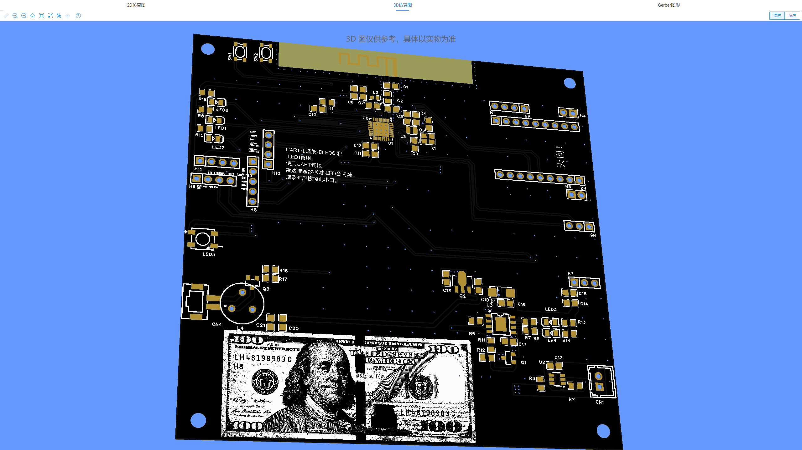

# 💧 智能物联网加湿器 V10 (全栈自研旗舰版)

  
  
  
  

---

## 📺 硬件风采与系统全貌 (Visual Showcase)

  
  

  
  

---

## ⚔️ 核心技术攻坚 (Technical Deep Dive)

本项目的系统稳定性与防护逻辑，是 V10 版本作为“最终交付版”的核心竞争力：

### 1. 🛡️ 硬件级动力安全限位 (Power Safety)
* **难点**：微孔雾化片谐振频率为 **108kHz**。若 PWM 功率过载，MOS 管极易击穿。
* **对策**：在 `bsp_atomizer.c` 中通过 AI 协同构建防御逻辑。无论上层指令如何变换，占空比均被物理锁定在 **45% (数值 135)** 以下。

### 2. 🔄 串口引脚软件层翻转 (UART Matrix)
* **难点**：天问 ASRPRO 模块强制 PA2 为 TX，与 PCB 物理走线冲突。
* **对策**：利用 ESP32-C3 的 **GPIO 矩阵路由**，调用 `uart_set_pin()` 将 **TX/RX 职责代码级翻转**，优雅解决硬件死区。

---

## 📂 核心资源导航 (已校准路径)

根据 V10 最终目录结构，以下资源可直接点击访问：

* 📝 **[源码包 (含详细中文注释)](main/)**
* 📎 **[电路原理图 PDF (自研 V10 版)](Hardware/电路原理图_智能加湿器V10_SCH_Schematic1_2026-03-26.pdf)**
* 🛠️ **[嘉立创 EDA 工程原文件 (EPRJ)](Hardware/Smart_Humidifier_V10.eprj)**
* 📦 **[Gerber 生产打板压缩包](Hardware/Gerber_Smart_Humidifier_V10.zip)**

---
© 2026 Developed by Lelechacc. | 致力于全栈嵌入式开发与 AI 协同进阶
