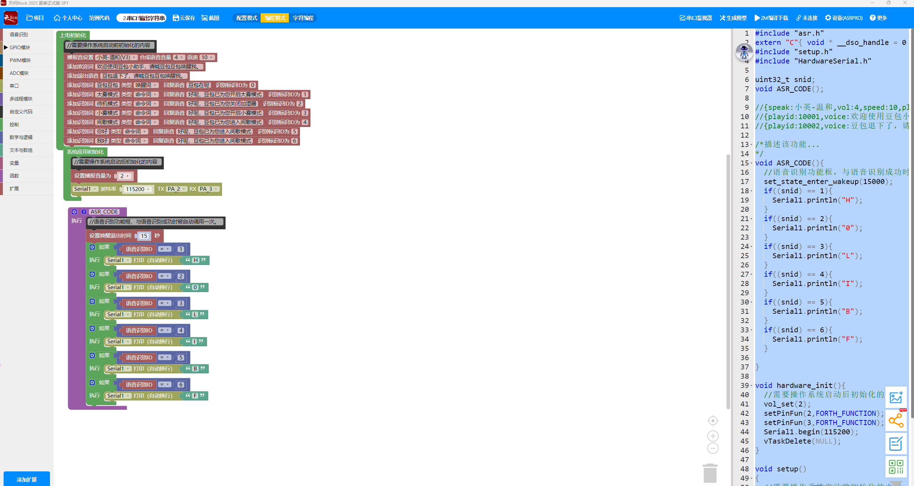

<!DOCTYPE html>
<html lang="zh-CN">
<head>
    <meta charset="UTF-8">
    <meta name="viewport" content="width=device-width, initial-scale=1.0">
    <title>Smart Humidifier V10 | 智能加湿器旗舰版</title>
    
</head>
<body>

    

        
        <header>
            <h1>Smart Humidifier V10</h1>
            最终交付稳定版 (全栈自研)
        </header>

        

            
            

                <video src="images/实物全功能演示视频.mp4" controls poster="images/实机演示_幻彩灯与雾化联动.jpg"></video>
            

            <aside class="technical-specs">
                

                    <h3>🛡️ 防御性功率锁定</h3>
                    
底层驱动强制定格 108kHz 硬件 PWM 频率，并绝对限制占空比低于 45% (135)，配合零电平启动逻辑，彻底杜绝硬件烧毁隐患。

                

                

                    <h3>🔄 协议引脚翻转</h3>
                    
利用 ESP32-C3 的 UART 矩阵路由技术，实现了 GPIO 物理职责翻转 (TX/RX 对调)，兵不血刃适配第三方离线语音模块走线死区。

                

                

                    <h3>⏱️ RMT 硬件时序驱动</h3>
                    
全面引入原生 RMT 硬件接管 WS2812B 色彩发送，告别 CPU 轮询翻转，确保 FreeRTOS 多任务调度下灯效丝滑不卡顿。

                

            </aside>

        

        <section class="hardware-gallery">
            <h2>硬件展示与系统全貌</h2>
            

                
                

                    
                    
嘉立创 EDA 3D 渲染正面整体架构

                

                
                

                    
                    
PCB 正面高度集成静态图

                

                

                    
                    
PCB 背面：双重电池保护电路细节

                

                

                    
                    
V10 最终版系统全套配件全貌

                

            

        </section>

        <section class="hardware-gallery">
            <h2>开源资源与打板资料</h2>
            

                
                

                    
                    
离线语音配置工具链展示 (ASRPRO)

                

                
                

                    

                        <h3 style="color: var(--accent-blue);">📎 V10 Gerber (打板文件)</h3>
                        
已上传，广大网友可直接下载使用。

                    

                    
位于 Hardware/ 目录下的核心 Gerber 压缩包

                

            

        </section>

        <footer>
            

                <a href="https://github.com/Lelechacc/Smart_Humidifier_V2" class="btn btn-primary">查看 GitHub 源码</a>
                <a href="Hardware/电路原理图_智能加湿器V10.pdf" class="btn btn-secondary">下载原理图 PDF</a>
            

            
© 2026 Developed by Lelechacc. |致力于嵌入式全栈协同开发 | V10 Final Release

        </footer>

    

</body>
</html>
